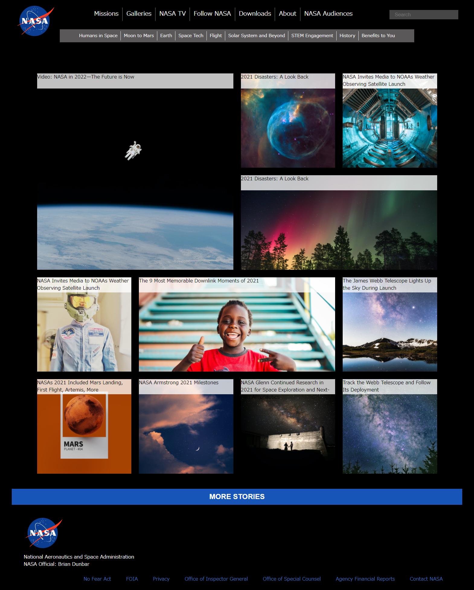

# Website Replication Challenge "NASA"

I made this as a part of Codecademy course "Codecaemy Project "Company Home Page with Flexbox" 
I selected NASA's website to challenge to replicate as it looked perfect to use my skills of Grid and Flex! 

To complete this, I used **HTML and CSS.**
I worked while paying attention to the following points;
**Grid / Flex / Responsive Design / Accessibility**

## Here is a screenshot of my website.

## And this is the original website from NASA.

